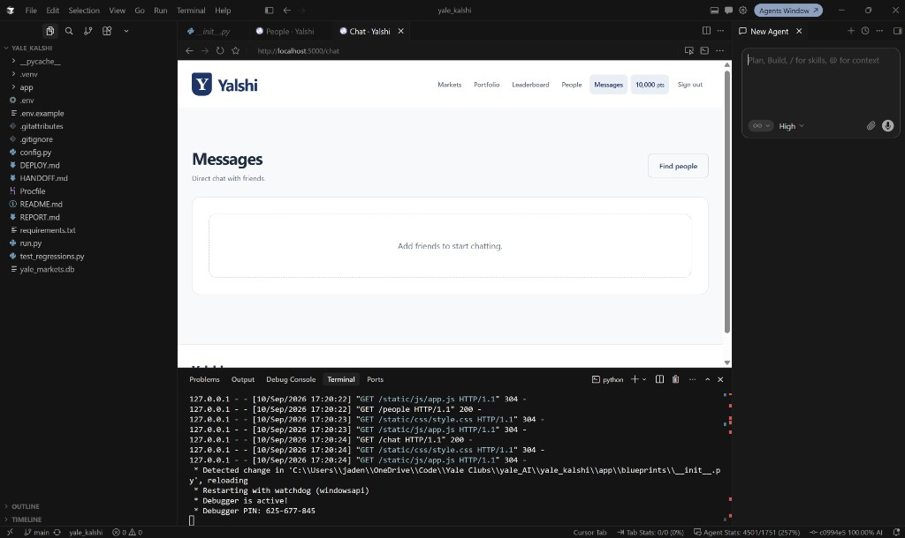

# Yalshi

**Yale’s campus prediction market — play points only.**

Built for the **Fall 2026 Yale AI × Cursor Hackathon**.

### Demo video

**Watch the walkthrough:** [https://youtu.be/GVpVMCxtQyI](https://youtu.be/GVpVMCxtQyI)

Yalshi is a Kalshi-style app for Yale students: create binary YES/NO markets about campus life, trade against an automated market maker, follow friends, and settle outcomes with a dispute window. Nothing here is real money.

Live idea: *Will Yale win The Game?* · *Will the next snow day cancel classes?* · *Will this dining hall run out of chicken fingers before Friday?*

### Built with Cursor

This project was developed in [Cursor](https://cursor.com) (agent-assisted coding, local run, and UI iteration):



---

## What you can do

### Markets & trading

- **Browse a popular feed** of open and closing markets, with friend activity chips when your friends are in a market
- **Create markets** (pending → admin approve → open) with clear resolution criteria and a close time
- **Trade YES / NO** against an **LMSR** automated market maker — prices move as people buy and sell
- **Cash out** all YES or NO shares from a market or your portfolio any time before settlement, including after purchases close. Use **Sell shares** to exit only part of a holding.
- **Portfolio**: cash, marked positions, earnings vs starting balance, leaderboard
- **Your submitted markets**: revisit your latest 50 submissions, check approval status, and read rejection reasons.

### Charts

- **Cash over time** — ledger history (seed, trades, settlements)
- **Bet value over time** — mark-to-market of each of your stakes as the market price moves (portfolio + market detail)

### Resolution

1. Purchases close; holders can still sell before settlement.
2. Creator proposes YES or NO with evidence
3. **24-hour dispute window** (configurable)
4. An undisputed proposal becomes eligible for automatic settlement after the deadline. Disputed markets wait for an admin.
5. Admins can settle a closed, proposed, or disputed market immediately, including during the dispute window. Open and pending markets cannot be settled.

Automatic settlement runs when the feed, market page, portfolio, or admin queue processes the market (the leaderboard also refreshes due markets). It is not a background timer. To process due markets without a page visit, run:

```powershell
python -m flask --app run:app settle-markets
```

Your hosting platform can run that command periodically. See [DEPLOY.md](DEPLOY.md).

### Social

- Search people, friend requests, profiles with earnings
- DMs between friends
- Market chat on each question

### Auth

- Designed for **Yale CAS** (`secure-tst` until ITS allowlists production)
- Until then: optional **access-code + NetID** login (`FRIEND_ACCESS_CODE`), including admins

---

## Stack

| Layer | Choice |
| --- | --- |
| App | Python **Flask** + Jinja |
| DB | **SQLite** by default; `DATABASE_URL` for Postgres / persistent SQLite |
| Trading | Binary LMSR (`LMSR_B`, default 100) |
| Auth | Yale CAS + optional friend access code |
| Deploy | **gunicorn** (`Procfile`), see [DEPLOY.md](DEPLOY.md) |

---

## Run locally

Requires Python 3.10 or newer. From the repository directory:

```powershell
python -m venv .venv
.\.venv\Scripts\Activate.ps1
pip install -r requirements.txt
if (!(Test-Path .env)) { Copy-Item .env.example .env }
```

Edit `.env`: replace the placeholder `FLASK_SECRET_KEY` with a persistent random secret and set `BOOTSTRAP_ADMIN_NETID`. For a local demo without CAS, set `DEV_AUTH_BYPASS=true`; sign in with a test NetID or the configured bootstrap admin NetID. Keep bypass off on public hosts.

Generate a secret with `python -c "import secrets; print(secrets.token_hex(32))"`, then save it in `.env`.

```powershell
python run.py
```

Open [http://localhost:5000](http://localhost:5000).

### Env you usually care about

| Variable | Purpose |
| --- | --- |
| `FLASK_SECRET_KEY` | Persistent session secret (required in prod) |
| `APP_BASE_URL` / `ORIGIN` | Public origin, no trailing slash |
| `BOOTSTRAP_ADMIN_NETID` | First admin NetID |
| `FRIEND_ACCESS_CODE` | Shared code for NetID login until CAS works |
| `DATABASE_URL` | Optional; unset → local `yale_markets.db` |
| `DISPUTE_HOURS` | Dispute window length (default `24`) |
| `DEV_AUTH_BYPASS` | Local-only easy login; keep `false` on public hosts |
| `SEED_DEMO_DATA` | Sample social/demo rows (`false` for real use) |

Full deploy checklist: [DEPLOY.md](DEPLOY.md). Copy from `.env.example`.

---

## Verify

```powershell
.\.venv\Scripts\python.exe -B -m unittest test_regressions -v
```

The current suite contains 28 regression tests covering authentication, CSRF, trade accounting, concurrent SQLite requests, early cash-out, settlement, market drafts, social privacy, chats, charts, and page rendering. Tests use isolated DBs and do not touch your real `yale_markets.db` or send email.

For a short demo: create a market as a student, approve it as the bootstrap admin, buy YES as the student, and buy more YES as a second test account. Return to the student's portfolio and cash out to demonstrate a price increase and realized proceeds. A past close time disables purchases while preserving cash-out until settlement.

Live CAS, SMTP delivery, and PostgreSQL deployment need environment-specific verification; the automated concurrency test uses SQLite.

---

## Product notes

- **Play points only** — not real money, not affiliated with Kalshi or Yale ITS
- **Anonymous display is on by default**. It hides NetIDs from public profiles and NetID searches; turning it off exposes the NetID. Admins can see NetIDs in their dashboard.
- SQLite on free hosts is often **ephemeral** across redeploys — use `DATABASE_URL` (Postgres or a durable volume) if you need to keep data
- CAS on a public URL needs ITS to allowlist `{APP_BASE_URL}/login_callback`
- Shared-code preview login intentionally accepts admin NetIDs too. Anyone with that code can act as an administrator; use only with trusted testers and disposable data. For real identities, leave the code empty and use CAS.

## Points and cash-out prices

One winning share pays 1 play point; a losing share pays 0. VOID returns 0.5 points per held share. Selling early credits points immediately and removes those shares from later settlement.

The displayed YES/NO price is the price of the next small trade. Cash-out estimates calculate the whole sale through the AMM, so proceeds can be lower than shares multiplied by the displayed price. Quotes may change before submission. Portfolio value uses the displayed price to mark holdings, so it is not a guaranteed liquidation value. Position charts show held-share value, not cumulative profit; a fully cashed-out position falls to zero while its proceeds move to cash.

## Repository layout

- `app/blueprints/`: pages, authentication, market actions, and admin/social routes.
- `app/services/`: pricing, ledger, cash-out, settlement, charts, notifications, and friends.
- `app/templates/` and `app/static/`: server-rendered UI, Yale palette, responsive layouts, and charts.
- `test_regressions.py`: isolated regression tests.
- `DEPLOY.md` and `.env.example`: deployment and configuration reference.

Internal reports and handoff notes are intentionally ignored by Git.

Made for campus. Powered by your perspective.

**Idea credit:** Kellen Gong
